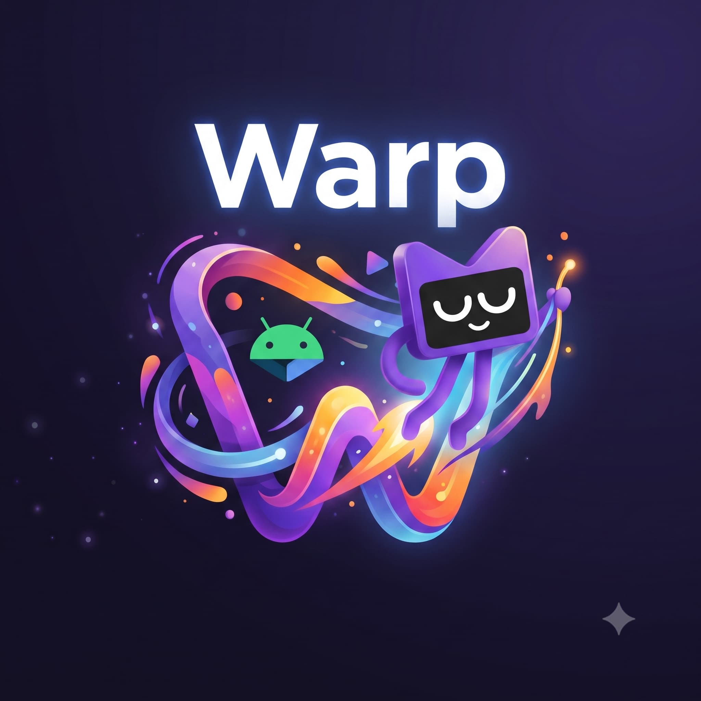
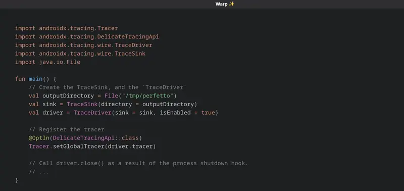

# Warp ✨ 🔮 🧬

Warp is an attempt at implementing Keynote style `Magic Move` (or PowerPoint `Morph`) for
code-snippets from the ground up.

## Demo

## Implementation

This project supports any programming language that has `TextMate` grammar.

- Uses `TM4E` (TextMate for Eclipse's JVM library to build token streams)

Structural diffing is done using
an [adaptation](shared/src/commonMain/kotlin/com/rahulrav/diff/HeckelDiff.kt) of the paper.

> P. Heckel, A technique for isolating differences between files
> Comm. ACM, 21, (4), 264–268 (1978).
> [Link](http://portal.acm.org/citation.cfm?id=359460.359467&dl=GUIDE&dl=ACM&idx=359460&part=periodical&WantType=periodical&title=Communications%20of%20the%20ACM)
